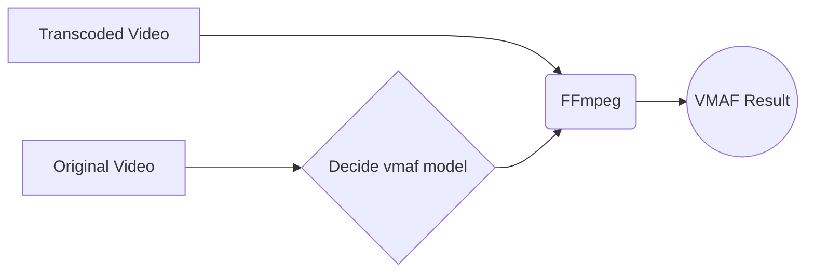

# VMAF Test
VMAF is a algorithm developed by Netlix to compare a transcoded video and it's original one, measuring a score that indicates how video quality was affected during encoding process ando how good/bad is the perception for whom watches.
VMAF can be aplied as a library at FFmpeg and it's avaible at: https://github.com/Netflix/vmaf.
This Python's script automate the analysis and decitions to analyse videos quality.

## Set up and run
1 - Install FFmpeg: https://ffmpeg.org/

2 - [Opctional] Copy the json files (vmaf models) to que Bin folder at FFmpeg path.

3 - Input the list of videos transcoded and original at the script at '_lista_de_videos_' .
Those videos must be at the same directory of the script.

4 - Run script

## How it works

